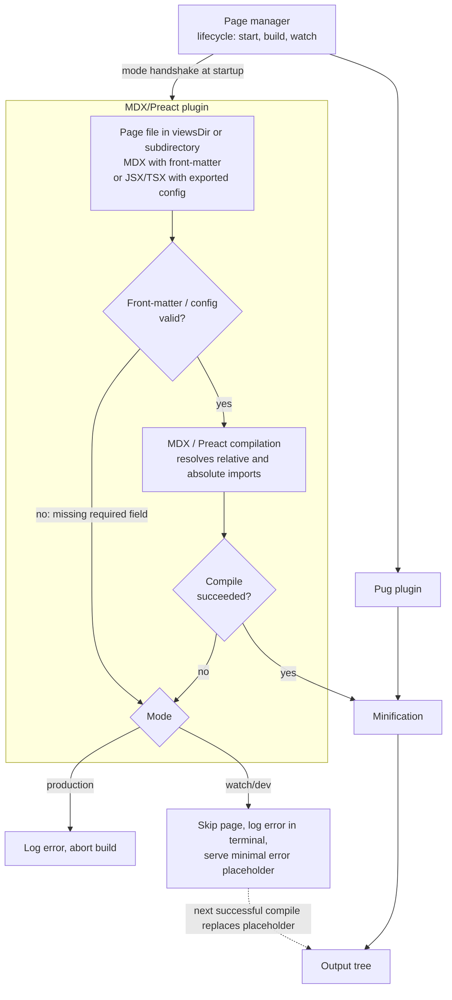

# Static Site Generation Pipeline With MDX and Preact

> **Status:** Explanation (conceptual). Describes intended behavior of the MDX/Preact compiler plugin so that tickets can be derived from it. It is not a procedure (see Guides) and does not weigh alternatives (see ADRs).

## Summary

The static site generator already turns page sources into HTML through a **page manager** that drives a **Pug plugin** and a **minification** step. This explanation describes a second page compiler, the **MDX/Preact plugin**, which runs in parallel with the Pug plugin and feeds the same downstream minification and output stages.

The plugin adds a new kind of page input (MDX and JSX/TSX using Preact components). It must not change how the existing pipeline behaves or what it produces for sites that do not use it.

## Pipeline Overview

## Components and Responsibilities

| Component | Responsibility |
|---|---|
| **Page manager** | Owns the lifecycle (startup, build, watch). Starts the plugins, tells them which mode is active, and collects their results. |
| **Pug plugin** | Existing compiler for Pug pages. Unchanged by this work. |
| **MDX/Preact plugin** | Discovers MDX and JSX/TSX pages, validates their metadata, compiles them to HTML, and hands the result to the shared minification step. |
| **Minification** | Existing step. Receives HTML from both plugins and does not need to know which plugin produced it. |
| **Output tree** | The generated files. Its structure is governed by the invariant below. |

## Placement in the Pipeline

The plugin runs **in parallel with the Pug plugin**, both under the page manager, and always **before minification**. It produces unminified HTML; minification stays a single shared stage. The plugin neither depends on nor blocks the Pug plugin.

## Mode Handshake

The plugin needs to know whether it runs in **production** (one-shot build) or **watch/dev** (long-running, rebuild on change).

- The mode comes **from the page manager lifecycle at startup**, as part of the plugin being initialized.
- There is **no additional CLI flag and no environment variable** for this purpose. Tickets must not introduce one.
- The mode is fixed for the lifetime of the process and determines failure behavior (see below).

## Page Inputs

The plugin accepts these inputs and nothing else:

- **MDX files with front-matter.** The front-matter carries page metadata, and some fields are required.
- **JSX/TSX files with an exported config.** The exported config plays the role of front-matter and has the same required fields.
- **Subdirectories of `viewsDir`.** Pages may be nested, and the nesting participates in output paths as it does for existing pages.
- **Preact component imports** from pages, by **relative or absolute path**.

The exact list of required fields is defined by the plugin's validation schema. Tickets should reference that schema rather than restate it.

## Validation

Validation happens **before compilation**, on front-matter (MDX) or exported config (JSX/TSX).

- If a required field is missing, the **build fails** with a **logged error** that identifies the page and the missing field(s).
- Compilation is not attempted for a page that fails validation.
- A validation failure is a page failure and follows the failure behavior below.

## Failure Behavior

Any page failure, whether a validation error or a compile error, is handled according to the mode.

| Mode | Behavior |
|---|---|
| **Production** | The build **aborts on any page failure**. The error is logged and the process ends unsuccessfully. No partial output is considered valid. |
| **Watch/dev** | The failing page is **skipped**. The error is **logged in the terminal**. The server serves a **minimal error placeholder** page containing the error message. Other pages keep building and serving. |

In watch/dev, the placeholder is **replaced by the real page on the next successful compile** of that page. No manual restart is needed.

## Invariants

1. **Output structure invariant.** For a site with **no embedded components** (no MDX/Preact pages), the generated file tree, in both **paths and names**, is **identical before and after the plugin is added**. The plugin must not add, rename, or relocate output files for existing pages.
2. **No new configuration surface for mode.** Mode is derived solely from the page manager lifecycle.
3. **Validation precedes compilation.** Invalid pages are never compiled.
4. **Production is strict, watch/dev is tolerant.** Never the reverse.
5. **Shared downstream.** Minification and output are common to both plugins.

## Out of Scope

- **Client-side JavaScript extraction**, handled in a separate epic.
- **Browser runtime execution** of Preact components (hydration or client rendering). The plugin produces static HTML only.
- **Formats other than MDX and Preact-based JSX/TSX.**

## Verify

- Confirm the exact required front-matter/config fields and their names against the plugin's validation schema.
- Confirm the MDX and Preact versions and their compatibility from the project's manifest and lockfile. This document does not assume any.
- Confirm how the page manager currently exposes lifecycle/mode to plugins, and adjust the "Mode Handshake" wording if the mechanism differs.